<div align="center">
  
</div>

<br />

<div align="center">

### `> heykode@github ~$ whoami`

**AI automation builder · JavaScript developer · Tooling explorer**

Building useful automation, agent workflows, and small products with clean interfaces.

[](https://github.com/Heykode)
[](https://github.com/Heykode)

</div>

<br />

<div align="center">
  
  
</div>

<br />

<div align="center">
  
</div>

<br />

<div align="center">

## ⚡ Featured Projects

<a href="https://github.com/Heykode/OpenReign-pro">
  
</a>

<br />
<br />

[](https://github.com/Heykode/OpenReign-pro)
[](https://github.com/Heykode/OpenReign-pro/stargazers)
[](https://github.com/Heykode/OpenReign-pro/commits)

</div>

<br />

<div align="center">

## 🛠 Tech Stack

**Languages and runtime**


**Automation and workspace**


<br />
<br />


</div>

<br />

<div align="center">

## 📈 Contribution Graph

<picture>
  <source media="(prefers-color-scheme: dark)" srcset="https://raw.githubusercontent.com/Heykode/Heykode/output/github-snake-dark.svg" />
  <source media="(prefers-color-scheme: light)" srcset="https://raw.githubusercontent.com/Heykode/Heykode/output/github-snake.svg" />
  
</picture>

</div>

<br />

<div align="center">
  

  

```text
The cleanest workflow is the one that makes useful things easier to ship.
```

</div>
